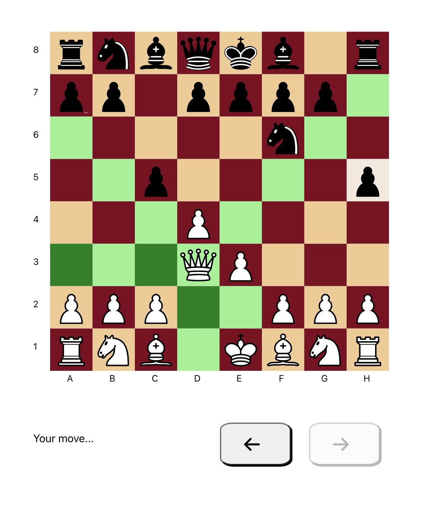
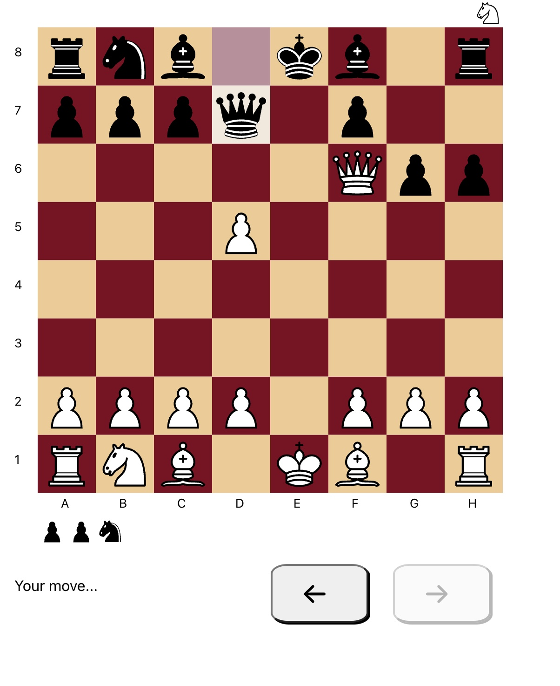
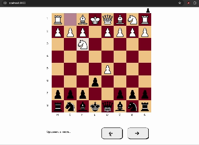

# chess-app

Source code for a pvp chess web app written in TypeScript and React. This repository currently contains a very basic websocket-based backend I have used for development and testing but it should definitely not be deployed anywhere. 

## Running locally

Clone this repo and cd to the newly create chess-app directory. Then run the following: 

```bash
cd client
npm run build
cd ..
npm run start
```

Navigate to localhost:3000

## Features

Legal move highlighting:




Captured pieces:



"forward" and "back" arrows to allow cycling through orevious moves:

