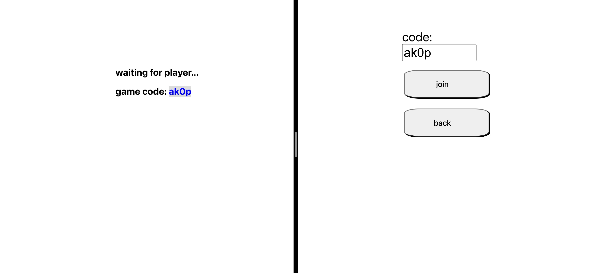
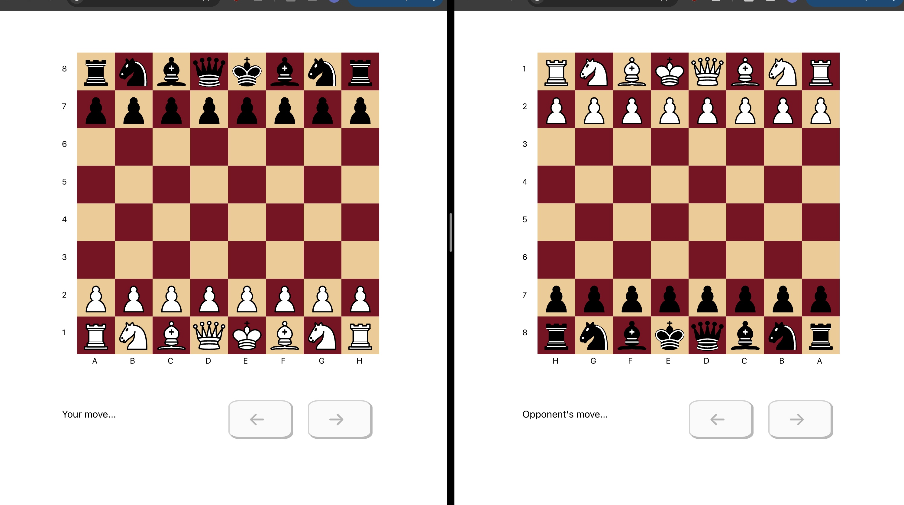

# chess-app

Source code for a pvp chess web app written in TypeScript and React. This repository currently contains a very basic websocket-based backend I have used for development and testing. It is not robust enough to be deployed in its current state. 

## Running locally

Clone this repo and cd to the newly create chess-app directory then run the following: 

```bash
cd client
npm run build
cd ..
npm run start
```

Navigate to localhost:3000 in your browser of choice and click 'create game'. Open another tab at localhost:3000 and click 'join game'.



Enter the code from the first tab and click 'join'. A chess game will begin in both tabs.



## Features

Legal move highlighting:


Captured pieces:


"forward" and "back" arrows to allow cycling through previous moves:


